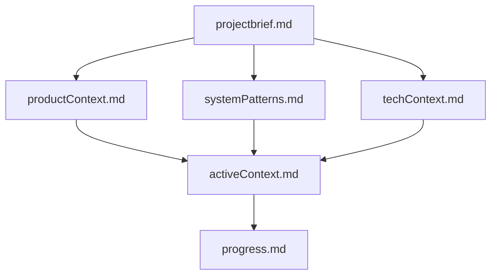

# Cursor Rules Integration: NicePhim Development Standards

## Overview
This document outlines the comprehensive cursor rules integration for the NicePhim movie streaming platform project. The cursor rules system provides development guidelines, coding standards, and documentation workflows to ensure consistent and high-quality development practices.

## Cursor Rules Structure

### Core Memory Bank System
The cursor rules implement a comprehensive memory bank system that serves as the foundation for all development work:

```
memory-bank/
├── projectbrief.md      # Foundation document - project scope and requirements
├── productContext.md    # Why project exists, problems it solves
├── activeContext.md     # Current work focus and recent changes
├── systemPatterns.md    # System architecture and design patterns
├── techContext.md       # Technologies, setup, and constraints
├── progress.md          # What works, what's left to build
└── cursor-rules.md      # This file - cursor rules documentation
```

### Memory Bank Hierarchy
The memory bank files build upon each other in a clear hierarchy:



## Development Workflows

### Plan Mode Workflow
When starting new development work:

1. **Read Memory Bank**: Review all memory bank files to understand current state
2. **Verify Context**: Ensure all files are complete and up-to-date
3. **Develop Strategy**: Create approach based on current context
4. **Present Approach**: Document strategy in chat

### Act Mode Workflow
When implementing features:

1. **Check Memory Bank**: Review current documentation
2. **Update Documentation**: Keep memory bank current
3. **Update .cursorrules**: Modify rules if needed
4. **Execute Task**: Implement with documented standards
5. **Document Changes**: Update memory bank with results

## Documentation Update Triggers

Memory bank updates occur when:
1. **Discovering new project patterns**
2. **After implementing significant changes**
3. **When user requests with *update memory bank***
4. **When context needs clarification**

## Development Standards

### Code Quality Standards
- **TypeScript**: Use interfaces for all data models
- **Java**: Follow Spring Boot best practices
- **Database**: Optimize queries and use proper indexing
- **Security**: BCrypt hashing, input validation, SQL injection prevention

### Error Handling Patterns
- **Warning vs Error Classification**: Distinguish between validation warnings and system errors
- **Auto-clear Functionality**: Clear errors when user starts typing
- **Real-time Feedback**: Provide immediate validation feedback

### Performance Patterns
- **Efficient Queries**: Optimize database operations
- **Caching**: Implement appropriate caching strategies
- **Parallel API Calls**: Use concurrent requests where beneficial

### File Organization
- **Frontend**: Standardized Next.js component structure
- **Backend**: MVC pattern with Controllers, Services, Repositories
- **Database**: Proper schema design with relationships

## Memory Bank Maintenance

### Required Core Files
1. **projectbrief.md**: Foundation document defining project scope
2. **productContext.md**: Business context and user experience goals
3. **activeContext.md**: Current work focus and recent changes
4. **systemPatterns.md**: Architecture and design patterns
5. **techContext.md**: Technology stack and constraints
6. **progress.md**: Current status and known issues

### Additional Context Files
Create additional files when needed for:
- Complex feature documentation
- Integration specifications
- API documentation
- Testing strategies
- Deployment procedures

## Integration with NicePhim Project

### Current Integration Status
- ✅ **Memory Bank Documentation**: Complete documentation system
- ✅ **Cursor Rules Creation**: Comprehensive .cursorrules file
- ✅ **Development Guidelines**: Complete standards documentation
- ✅ **Documentation Workflow**: Established update procedures

### Project-Specific Standards
- **Authentication**: BCrypt password hashing with salt rounds
- **Database**: UUID primary keys, foreign key constraints
- **Frontend**: Next.js 15 with App Router, TypeScript interfaces
- **Backend**: Spring Boot 3.1.5 with Java 17, MVC architecture
- **Real-time**: WebSocket with STOMP protocol for watch-together features

## Benefits of Cursor Rules Integration

1. **Consistency**: Standardized development practices across the project
2. **Documentation**: Comprehensive project knowledge preservation
3. **Quality**: Enforced code quality and security standards
4. **Efficiency**: Streamlined development workflows
5. **Maintainability**: Clear patterns and documentation for future development

## Future Enhancements

- **Automated Testing**: Integration with testing frameworks
- **Code Analysis**: Automated code quality checks
- **Deployment**: Standardized deployment procedures
- **Monitoring**: Performance and error monitoring standards

---

*This document is part of the NicePhim project's memory bank system and should be updated whenever cursor rules or development standards change.*